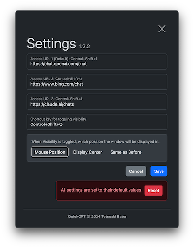

<p align="center">
  
</p>

# QuickGPT

An application that instantly opens open ai chat (chat gpt or custom url) on your desktop

 * Quick-1: You can instantly switch between displaying and hiding chats with keyboard shortcuts.
 * Quick-2: The chat window is always displayed on the position(mouse, display center, last position) where you want.
 * Quick-3: When switching between views, the input prompt is automatically activated so that you can enter text immediately.




## Usage
### 0. download
 - Download the latest version from the link below.
   * https://github.com/TetsuakiBaba/quickGPT/releases
### 1. Show/Hide the chat window
 - Press Control+Shift+Q to show/hide the chat window.
 - If you want to open a custom chat, you can open it by entering the URL in the settings.
### 2. Switch the chat window
 - Press Control+Shift+1,2,3 to switch the chat window.
  - If you want to switch to a custom chat, you can switch it by entering the URL in the settings.

## Shortcut list
 - Control+Shift+Q: Toggle window display
 - Control+Shift+1,2,3: Change the chat window


# Installation
## macOS, Windows
A binary package is available for users on macOS. Please download the latest version of the zip file from the link below.
 * https://github.com/TetsuakiBaba/quickGPT/releases

## Linux
Since we do not distribute binary packages, please follow the Build instructions to build the package.

# Build
```
git clone https://github.com/TetsuakiBaba/quickGPT.git
cd quickGPT
npm install
npm start
```

If you want to make a application file on macOS, follow the below steps.

```
npm exec --package=@electron-forge/cli -c "electron-forge import"
npm run make
open ./out/QuickGPT-darwin-arm64/QuickGPT.app 
```
